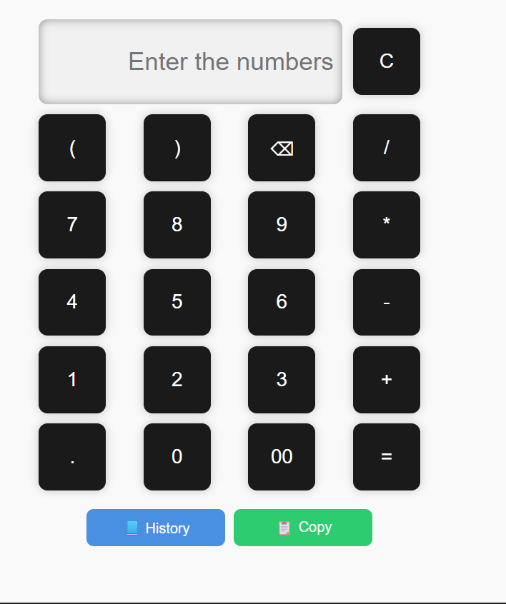

# Nishant-Sonkamble.github.io

portifolio/
<!DOCTYPE html>
<html lang="en">
<head>
  <meta charset="UTF-8" />
  <meta name="viewport" content="width=device-width, initial-scale=1.0"/>
  <title>My Portfolio</title>

  
</head>
<body>

  <header>
    <h1 onmouseover="highlightHeader(this)" onmouseout="unhighlightHeader(this)">Nishant Sonkamble </h1>
    
1st Year CS Student | Learning Web Development

  </header>

  <section id="about">
    <h2>About Me</h2>
    

    

      "I'm a first-year Computer Science student currently learning HTML, CSS, and JavaScript. While there's still much to learn, I'm committed to improving through hands-on experience and embracing challenges. I enjoy exploring new technologies and expanding my skill set.I'm currently interested in web development and have started building simple websites to apply my learning."    

    

  </section>

  <section id="projects">
  <h2>Projects</h2>

  

    <h3>Simple Calculator</h3>

    

    
A basic calculator using HTML, CSS, and JavaScript.

       <a href="calci for internship.html">Live Demo</a> |
    <a href="https://github.com/Nishant-Sonkamble/calculator-for-internship/tree/main">GitHub Code</a>
  

</section>

  <section id="skills">
    <h2>Skills</h2>
    <ul>
      <li>HTML</li>
      <li>CSS</li>
      <li>JavaScript (Basic)</li>
    </ul>
  </section>

  <section id="learning">
    <h2>Currently Learning</h2>
    
Focused on learning JavaScript and building interactive web pages. Planning to learn about coding language such as python,c++,etc.

  </section>

<section id="Resume">
    <h2>My resume</h2>
    
To see my resume<a href="documents/Nishnat resume(1).pdf"> Click here</a>

  </section>

  <section id="contact">
  <h2>Contact</h2>

  

    Email:
    <a href="mailto:sonkamblenishant4@gmail.com">sonkamblenishant4@gmail.com</a>
  

  

    LinkedIn:
    <a href="https://www.linkedin.com/in/nishant-sonkamble-632ba6334?trk=contact-info" target="_blank">
      linkedin.com/in/nishant-sonkamble
    </a>
  

  <button class="button" onclick="sayHello()">Click Me</button>
</section>

  <footer>
    
© 2025 Nishant Sonkamble

  </footer>

  

</body>
</html>
